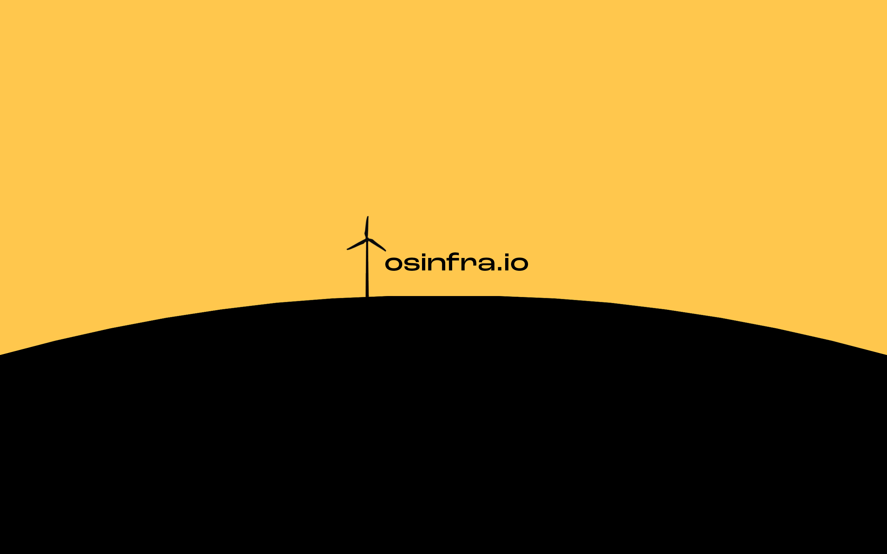

# Documentation

This site is dedicated to implementing a baseline infrastructure as code (IaC) framework using a consolidated convenience, over the best-of-breed approach.  The intent is to speak to as many people as possible by keeping the system simple, efficient, and not too opinionated.&#x20;

Your day-2+ operations are critical for successful cloud implementations. We think about that before day-0 so you don't have to, or worse don't!
