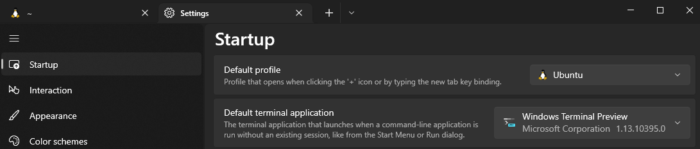
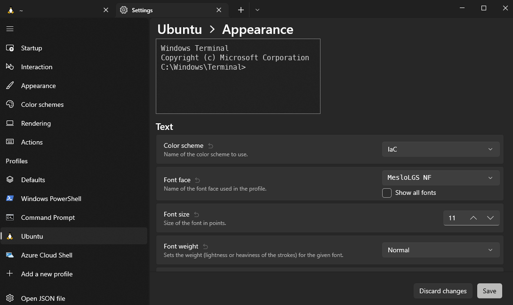
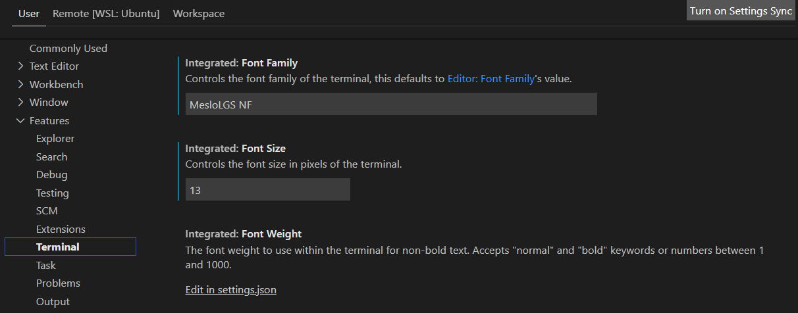

# Windows (WSL Ubuntu)


Windows has become an excellent choice for sandbox development with the addition of [Windows Subsystem for Linux](https://docs.microsoft.com/en-us/windows/wsl/install) (WSL). You can run complete Linux environments directly on Windows. [Visual Studio Code](https://code.visualstudio.com) (VS Code), a code editor of choice for many folks, also supports [Remote WSL](https://marketplace.visualstudio.com/items?itemName=ms-vscode-remote.remote-wsl). This extension lets you use the Windows Subsystem for Linux as your full-time development environment from Visual Studio Code!

The official documentation can be found here:

* [Install Windows Subsystem for Linux](https://docs.microsoft.com/en-us/windows/wsl/install)
* [Install Windows Terminal](https://docs.microsoft.com/en-us/windows/terminal/install)
* [Install Visual Studio Code](https://code.visualstudio.com/docs/setup/windows)

## Prerequisites <a href="#prerequisites" id="prerequisites"></a>

You must run Windows 10 version 2004 and higher (Build 19041 and higher) or Windows 11. If you're running an older build or just prefer not to use the install command and would like step-by-step directions, see [**WSL manual installation steps for older versions**](https://docs.microsoft.com/en-us/windows/wsl/install-manual).

## Install

###  Windows Subsystem for Linux (Ubuntu)

Open up a Windows Command Prompt as the administrator run the following command and restart your computer.

```powershell
wsl --install
```


You can uninstall the Linux distribution and start fresh by running:

```powershell
wsl --unregister Ubuntu; wsl --install -d Ubuntu
```


###  Windows Terminal

Install Windows Terminal by searching the Microsoft Store for "Windows Terminal" or use the following download link.

* [Windows Terminal](https://www.microsoft.com/store/productId/9N0DX20HK701)


If you'd like to run the Windows Terminal Preview, you should use the following download link.

* [Windows Terminal Preview](https://www.microsoft.com/store/productId/9N8G5RFZ9XK3)


Set your default profile and default terminal application in the settings:



Later in the Ubuntu setup, we will install [Powerlevel10k](https://github.com/romkatv/powerlevel10k), a theme for Zsh that emphasizes [speed](https://github.com/romkatv/powerlevel10k#uncompromising-performance), [flexibility](https://github.com/romkatv/powerlevel10k#extremely-customizable), and [out-of-the-box experience](https://github.com/romkatv/powerlevel10k#configuration-wizard).

Installation of the following fonts is recommended:

* [MesloLGS NF Regular.ttf](https://github.com/romkatv/powerlevel10k-media/raw/master/MesloLGS%20NF%20Regular.ttf)
* [MesloLGS NF Bold.ttf](https://github.com/romkatv/powerlevel10k-media/raw/master/MesloLGS%20NF%20Bold.ttf)
* [MesloLGS NF Italic.ttf](https://github.com/romkatv/powerlevel10k-media/raw/master/MesloLGS%20NF%20Italic.ttf)
* [MesloLGS NF Bold Italic.ttf](https://github.com/romkatv/powerlevel10k-media/raw/master/MesloLGS%20NF%20Bold%20Italic.ttf)

[Nerd Fonts](https://www.nerdfonts.com) also has some good options. For example, [RobotoMono](https://github.com/ryanoasis/nerd-fonts/releases/download/v2.1.0/RobotoMono.zip) is nice.

Set the font in Windows Terminal settings for the desired profile:



###  Linux (WSL) Setup (Ubuntu)

With a complete Linux environment on Windows with Windows Subsystem for Linux (WSL). We can access the Linux terminal, develop cross-platform applications, and manage infrastructure without leaving Windows.

#### Tools Install

To install all the local tools on Ubuntu, please follow the documentation on the following page.


[ubuntu-setup.md](ubuntu-setup.md)


###  Visual Studio Code

Install Visual Studio Code by searching the Microsoft Store for "Visual Studio Code" or use the following download link.

* [Visual Studio Code](https://code.visualstudio.com/download)


If you'd like to run the insider build of Visual Studio Code, you should use the following download link.

* [Visual Studio Code Insiders](https://code.visualstudio.com/insiders)


#### Install Extensions

VS Code extensions let you add languages and tools to your installation to support your development workflow. To install extensions, open up Visual Studio Code and select the extension's icon in the sidebar: 

You can [browse for extensions](https://code.visualstudio.com/docs/editor/extension-marketplace#\_browse-for-extensions):

* The [Remote - WSL](https://marketplace.visualstudio.com/items?itemName=ms-vscode-remote.remote-wsl) extension lets you use Visual Studio Code on Windows to build Linux applications that run on the WSL. You get all the productivity of Windows while developing with Linux-based tools, runtimes, and utilities.


After installing this extension, select the open a remote window icon:  in the bottom left, choose "New WSL Window" and close the old window. You are now running in Linux and can install the other extensions. You should see "Install in WSL: Ubuntu" or now when installing the extensions that prefer to run in Linux. The [Docker](https://marketplace.visualstudio.com/items?itemName=ms-azuretools.vscode-docker) extension makes building, managing, and deploying containerized applications from Visual Studio Code easy.


* The [GitHub Actions](https://marketplace.visualstudio.com/items?itemName=GitHub.vscode-github-actions) extension lets you manage your workflows, view the workflow run history, and helps with authoring workflows.
* [GitHub Codespaces](https://marketplace.visualstudio.com/items?itemName=GitHub.codespaces) provides cloud-hosted development environments for any activity - whether a long-term project or a short-term task like reviewing a pull request. You can connect to Codespaces from Visual Studio Code or a browser-based editor that's accessible anywhere.
* [GitHub Copilot Chat](https://marketplace.visualstudio.com/items?itemName=GitHub.copilot-chat) is a companion extension to [GitHub Copilot](https://copilot.github.com/) that houses preview Chat features.
* [GitHub Copilot Nightly](https://marketplace.visualstudio.com/items?itemName=GitHub.copilot-nightly) provides autocomplete-style suggestions from an AI pair programmer as you code. You can receive suggestions from GitHub Copilot either by starting to write the code you want to use or by writing a natural language comment describing what you want the code to do.
* The [GitHub Pull Requests and Issues](https://marketplace.visualstudio.com/items?itemName=GitHub.vscode-pull-request-github) extension allows you to review and manage GitHub pull requests and issues in Visual Studio Code.
* The [HashiCorp HCL Extension](https://marketplace.visualstudio.com/items?itemName=hashicorp.hcl) for Visual Studio Code (VS Code) adds syntax highlighting for [HCL](https://www.hashicorp.com/) files.
* Using the Terraform Language Server, the [HashiCorp Terraform extension](https://marketplace.visualstudio.com/items?itemName=HashiCorp.terraform) adds syntax highlighting and other editing features for Terraform files.
* The [Infracost](https://marketplace.visualstudio.com/items?itemName=Infracost.infracost) extension shows you cost estimates for Terraform right in your editor! Prevent costly infrastructure changes before they get into production.
* The extension for developers building applications to run in [Kubernetes ](https://marketplace.visualstudio.com/items?itemName=ms-kubernetes-tools.vscode-kubernetes-tools)clusters and for DevOps staff troubleshooting Kubernetes applications.
* The [Markdownlint](https://marketplace.visualstudio.com/items?itemName=DavidAnson.vscode-markdownlint) extension provides markdown linting and style checking for Visual Studio Code.
* The [Ruby](https://marketplace.visualstudio.com/items?itemName=rebornix.Ruby) extension provides enhanced Ruby language and debugging support for Visual Studio Code.
* The [YAML](https://marketplace.visualstudio.com/items?itemName=redhat.vscode-yaml) extension provides comprehensive YAML Language support to Visual Studio Code, via the [yaml-language-server](https://github.com/redhat-developer/yaml-language-server), with built-in Kubernetes syntax support.

#### Settings

Set terminal font family to work with [Powerleve10k](https://github.com/romkatv/powerlevel10k).


