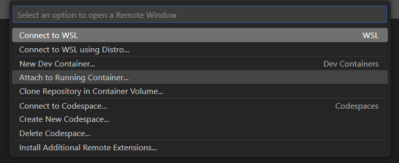

# Docker

<figure><figcaption></figcaption></figure>

## Images

Images for Ubuntu and Gentoo are available. Choose the image you are most familiar with.



Pull the following image from the GitHub container registry.

```bash
docker pull ghcr.io/osinfra-io/ubuntu:latest
```

Run the image in interactive mode.

```bash
docker run -it ghcr.io/osinfra-io/ubuntu:latest
```



Pull the following image from the GitHub container registry.

```bash
docker pull ghcr.io/osinfra-io/gentoo:latest
```

Run the image in interactive mode.

```bash
docker run -it ghcr.io/osinfra-io/gentoo:latest
```



## Visual Studio Code

Install the [Dev Containers](https://marketplace.visualstudio.com/items?itemName=ms-vscode-remote.remote-containers) extension for Visual Studio Code. The extension lets you use a [Docker container](https://docker.com/) as a full-featured development environment.

In Visual Studio Code, you can click the open a remote window icon  and select attach to running container.

<figure><figcaption></figcaption></figure>

Next, select the running container from the previous step.

<figure><figcaption></figcaption></figure>
