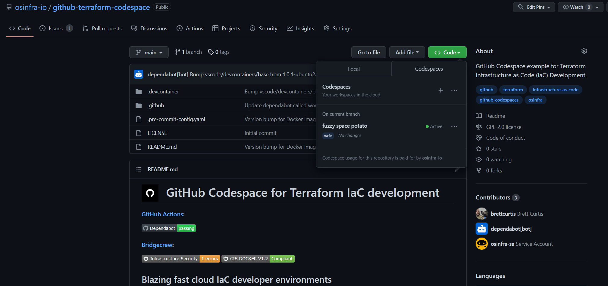

# GitHub Codespaces

<figure><figcaption></figcaption></figure>

[GitHub Codespaces](https://github.com/features/codespaces) provides cloud-hosted development environments for any activity - whether a long-term project or a short-term task like reviewing a pull request. You can connect to Codespaces from Visual Studio Code or a browser-based editor that's accessible anywhere.

This [repository](https://github.com/osinfra-io/github-terraform-codespace) has an example GitHub Codespace for Infrastructure as Code (IaC) development.&#x20;

We recommend forking the repository for use. Its purpose is to be a baseline, something you can maintain and modify to fit your organization's needs. Once you go down the road of Infrastructure as Code (IaC), what you will find is onboarding developers takes time and can be confusing for people new to development, and that will limit contributions. Using a GitHub Codespace for Infrastructure as Code (IaC) will:

* Standardized Infrastructure as Code (IaC) developer environments
* Simplify onboarding so new IaC developers can contribute easier

## Install the GitHub Codespaces Extension

You can [browse for extensions](https://code.visualstudio.com/docs/editor/extension-marketplace#\_browse-for-extensions):

* The [GitHub Codespaces](https://marketplace.visualstudio.com/items?itemName=GitHub.codespaces) extension lets you develop in a cloud-hosted environment enabling repeatability and reliability for developers.

## Open up the Codespace in Visual Studio Code

Go to your GitHub Codespace repository, click on the code dropdown, select Codespaces, and create a new Codspace on main.

<figure><figcaption></figcaption></figure>

