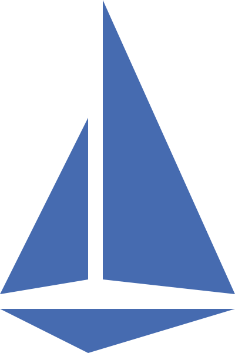

# Istio

<figure><figcaption></figcaption></figure>

[Istio](https://istio.io) extends Kubernetes to establish a programmable, application-aware network. Working with Kubernetes and traditional workloads, Istio brings standard, universal traffic management, telemetry, and security to complex deployments.

<figure><figcaption></figcaption></figure>

Istio was accepted to [CNCF](https://www.cncf.io/projects/istio) on September 30, 2022, at the **Incubating** maturity level and then moved to the **Graduated** maturity level on July 12, 2023.
