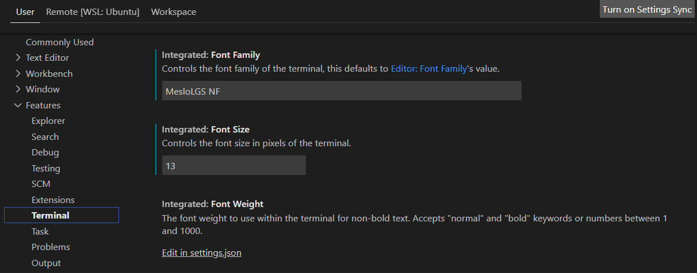

# Windows (WSL)


Windows has become an excellent choice for sandbox development with the addition of [Windows Subsystem for Linux](https://docs.microsoft.com/en-us/windows/wsl/install) (WSL). You can run complete Linux environments directly on Windows. [Visual Studio Code](https://code.visualstudio.com) (VS Code), a code editor of choice for many folks, also supports [Remote WSL](https://marketplace.visualstudio.com/items?itemName=ms-vscode-remote.remote-wsl). This extension lets you use the Windows Subsystem for Linux as your full-time development environment right from VS Code!

The official documentation can be found here:

* [Install Windows Subsystem for Linux](https://docs.microsoft.com/en-us/windows/wsl/install)
* [Install Windows Terminal](https://docs.microsoft.com/en-us/windows/terminal/install)
* [Install Visual Studio Code](https://code.visualstudio.com/docs/setup/windows)

## Prerequisites <a href="#prerequisites" id="prerequisites"></a>

You must be running Windows 10 version 2004 and higher (Build 19041 and higher) or Windows 11. If you're running an older build, or just prefer not to use the install command and would like step-by-step directions, see [**WSL manual installation steps for older versions**](https://docs.microsoft.com/en-us/windows/wsl/install-manual).

## Install

###  Windows Subsystem for Linux

Open up a Windows Command Prompt as the administrator run the following command and restart your computer.

```powershell
wsl --install
```


You can uninstall the Linux distribution and start fresh by running:

```powershell
wsl --unregister Ubuntu; wsl --install -d Ubuntu
```


###  Windows Terminal

Install Windows Terminal by searching the Microsoft Store for "Windows Terminal" or use the following download link.

* [Windows Terminal](https://www.microsoft.com/store/productId/9N0DX20HK701)


If you'd like to run the Windows Terminal Preview you should use the following download link.

* [Windows Terminal Preview](https://www.microsoft.com/store/productId/9N8G5RFZ9XK3)


Set your default profile and default terminal application in the settings:


Select your Ubuntu profile and change the starting directory:


Later on in the Ubuntu setup, we will install [Powerlevel10k](https://github.com/romkatv/powerlevel10k) a theme for Zsh that emphasizes [speed](https://github.com/romkatv/powerlevel10k#uncompromising-performance), [flexibility](https://github.com/romkatv/powerlevel10k#extremely-customizable), and [out-of-the-box experience](https://github.com/romkatv/powerlevel10k#configuration-wizard).

Installation of the following fonts is recommended:

* [MesloLGS NF Regular.ttf](https://github.com/romkatv/powerlevel10k-media/raw/master/MesloLGS%20NF%20Regular.ttf)
* [MesloLGS NF Bold.ttf](https://github.com/romkatv/powerlevel10k-media/raw/master/MesloLGS%20NF%20Bold.ttf)
* [MesloLGS NF Italic.ttf](https://github.com/romkatv/powerlevel10k-media/raw/master/MesloLGS%20NF%20Italic.ttf)
* [MesloLGS NF Bold Italic.ttf](https://github.com/romkatv/powerlevel10k-media/raw/master/MesloLGS%20NF%20Bold%20Italic.ttf)

[Nerd Fonts](https://www.nerdfonts.com) also has some good options. For example, [RobotoMono](https://github.com/ryanoasis/nerd-fonts/releases/download/v2.1.0/RobotoMono.zip) is nice.

Set the font in Windows Terminal settings for the Ubuntu profile:


### Ubuntu (WSL) Setup

With a complete Ubuntu terminal environment on Windows with Windows Subsystem for Linux (WSL). We can access the Linux terminal, develop cross-platform applications, and manage infrastructure without leaving Windows.

## Tools Install

To install all the local tools we will need you can run the following commands.

This is optional but will allow for `sudo` access without entering a password.

```bash
 echo "$USER ALL=(ALL) NOPASSWD:ALL" | sudo EDITOR='tee -a' visudo
```

This script is in the [lzysh/local-development-setup](https://github.com/lzysh/local-development-setup/blob/main/ubuntu/setup.sh) repo.

```
/bin/bash -c "$(curl -fsSL https://raw.githubusercontent.com/lzysh/local-development-setup/main/ubuntu/setup.sh)"
```

Change your default shell to Zsh and exit.

```
chsh -s /home/linuxbrew/.linuxbrew/bin/zsh; exit
```

When you start Windows Terminal you will be prompted to set up [Powerlevel10k](https://github.com/romkatv/powerlevel10k). Choose the options you like and go!

Once complete you can stay up to date by running the generated update script.

```
~/bin/update.sh
```

###  Visual Studio Code

Install VS Code by searching the Microsoft Store for "Visual Studio Code" or use the following download link.

* [Visual Studio Code](https://code.visualstudio.com/download)


If you'd like to run the insider build of Visual Studio Code you should use the following download link.

* [Visual Studio Code Insiders](https://code.visualstudio.com/insiders)


#### Install Extensions

VS Code extensions let you add languages and tools to your installation to support your development workflow. To install extensions open up VS Code and select the extension's icon in the sidebar: 

You can [browse for extensions](https://code.visualstudio.com/docs/editor/extension-marketplace#\_browse-for-extensions):

* The [Remote - WSL](https://marketplace.visualstudio.com/items?itemName=ms-vscode-remote.remote-wsl) extension lets you use VS Code on Windows to build Linux applications that run on the WSL. You get all the productivity of Windows while developing with Linux-based tools, runtimes, and utilities.


After installing this extension select the open a remote window icon:  in the bottom left, choose "New WSL Window" and close the old window. You are now running in Ubuntu and you can install the other extensions. You should see "Install in WSL: Ubuntu" now when installing the extensions that prefer to run in Ubuntu.


* The [HashiCorp Terraform](https://marketplace.visualstudio.com/items?itemName=HashiCorp.terraform) VS Code extension adds syntax highlighting and other editing features for [Terraform](https://www.terraform.io) files using the [Terraform Language Server](https://github.com/hashicorp/terraform-ls).
* The [GitHub Pull Requests and Issues](https://marketplace.visualstudio.com/items?itemName=GitHub.vscode-pull-request-github) extension allows you to review and manage GitHub pull requests and issues in VS Code.
* The [Markdown All in One](https://marketplace.visualstudio.com/items?itemName=yzhang.markdown-all-in-one) extension is all you need for Markdown (keyboard shortcuts, table of contents, auto preview, and more).
* The [Ruby](https://marketplace.visualstudio.com/items?itemName=rebornix.Ruby) extension provides enhanced Ruby language and debugging support for VS Code.
* The [YAML](https://marketplace.visualstudio.com/items?itemName=redhat.vscode-yaml) extension provides comprehensive YAML Language support to VS Code, via the [yaml-language-server](https://github.com/redhat-developer/yaml-language-server), with built-in Kubernetes syntax support.
* The [Checkov](https://marketplace.visualstudio.com/items?itemName=Bridgecrew.checkov) Extension for VS Code enables developers to get real-time scan results, as well as inline fix suggestions as they develop cloud infrastructure.

#### Settings

Set terminal font family to work with [Powerleve10k](https://github.com/romkatv/powerlevel10k).


